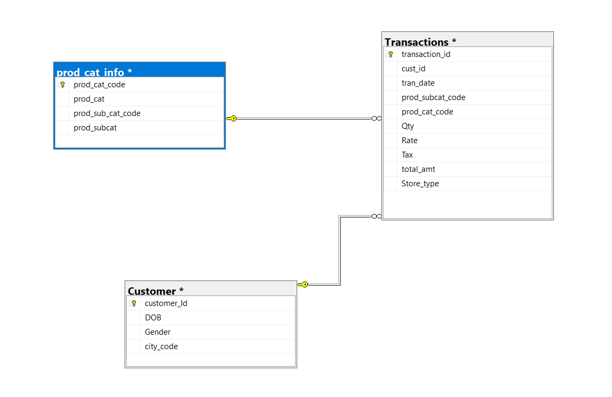

# 📊 Retail Sales Data Analysis using SQL

Retail Sales Data Analysis using SQL to understand customer behavior, product performance, and transaction trends.

## 🎯 Project Objective

The objective of this project is to analyze retail transaction data using SQL to understand customer behavior, sales performance, product demand, and store operations.

By writing structured SQL queries, the project extracts meaningful insights from raw transactional data and answers important business questions related to customer demographics, product categories, sales trends, and returns.

## 📌 Project Overview

This project focuses on analyzing retail point-of-sale (POS) data using SQL. The dataset contains information about customers, transactions, and product categories.

Through SQL queries, the project performs data exploration, data preparation, and business analysis to identify patterns in customer purchasing behavior, sales performance across product categories, and store-level operations.

The analysis demonstrates how SQL can be used to transform raw transactional data into actionable business insights.

## 🛠 Tech Stack

The analysis was performed using the following tools and technologies:

🗄 SQL (Structured Query Language)
Used to query and analyze data stored in relational tables.

💻 Microsoft SQL Server / SQL Environment
Used for executing queries and managing the database.

📊 Data Analysis using SQL Queries
Applied SQL operations such as filtering, aggregation, joins, grouping, and conditional logic to answer business questions.

🗂 GitHub
Used to host the SQL scripts and documentation as part of a professional data analytics portfolio.

## 📂 Dataset Description

The dataset consists of three relational tables containing retail transaction and customer information.

**Customer Table**
Contains customer demographic information including:

- Customer ID
- Gender
- Date of Birth
- City Code

This table helps analyze customer segments and demographic patterns.

## 🗺 Database Schema (ER Diagram)

The following Entity Relationship Diagram shows how the tables in the retail database are connected.

**Transactions Table**
Contains detailed records of customer purchases including:

- Transaction ID
- Customer ID
- Transaction Date
- Product Category
- Quantity
- Total Amount
- Store Type
- Channel
- Return information

This table represents the core transactional data used for sales analysis.

**Product Category Table**
Contains product hierarchy information including:

- Product Category
- Product Sub Category

This table allows analysis of sales performance across different product categories and sub-categories.

## 🔎 Data Preparation

Before performing the analysis, several data preparation steps were completed using SQL:

Checked the total number of records in each table

Identified transactions that involved product returns

Converted date fields into proper SQL date format

Determined the time range of the transaction dataset

Verified product category relationships within the dataset

These steps ensured that the data was ready for accurate analysis.

## 📊 Key Business Analysis Performed

Using SQL queries, several business questions were answered to understand customer and sales behavior.

📈 **Sales Channel Analysis**

Identified the most frequently used transaction channel, helping understand how customers prefer to shop.

 👥 **Customer Demographics**

Analyzed the distribution of male and female customers and identified cities with the highest number of customers.

 📚 **Product Category Analysis**

Explored product category structures and analyzed sub-category distribution within categories such as Books.

🛒 **Transaction Insights**

Identified:

Maximum quantity of products ever ordered

Customers with more than 10 successful transactions

Store types with the highest sales volume

## 💰 Revenue Analysis

Calculated revenue insights including:

Total revenue from Electronics and Books

Revenue generated from Flagship Stores

Revenue generated by Male customers in Electronics category

Category performance compared to overall averages

## 🔄 Returns Analysis

Analyzed product returns to determine:

Percentage of sales vs returns by product sub-category

Categories with the highest return value in recent months

## 📊 Customer Age Segment Analysis

Evaluated revenue generated by customers aged 25–35 years within the most recent transaction period.

This analysis helps businesses understand high-value customer segments.

## 📈 Insights Generated

Some key insights derived from the analysis include:

Identification of the most frequently used transaction channels

Understanding customer distribution across cities

Determining high-performing product categories

Measuring the impact of returns on overall revenue

Identifying high-value customers and store types

Comparing product category performance based on revenue and quantity sold

These insights help businesses make data-driven decisions related to marketing, inventory planning, and customer targeting.

## 🚀 Skills Demonstrated

Through this project, the following data analytics skills were applied:

SQL Query Writing

Data Exploration

Data Cleaning & Preparation

Joins and Table Relationships

Aggregations and Grouping

Filtering and Conditional Logic

Business Data Analysis

Generating Data-Driven Insights

## 📁 Project Files

The repository contains the following files:

- `Retail_SQL_Case_Study_Problem.pdf` – Original case study questions
- `Retail_Sales_SQL_Analysis.sql` – SQL queries used for analysis
- `Customer.csv` – Customer demographic dataset
- `Transactions.csv` – Transaction data
- `prod_cat_info.csv` – Product category information

## 👩‍💻 Author

**Charanjeet Kaur**  
Aspiring Data Analyst
